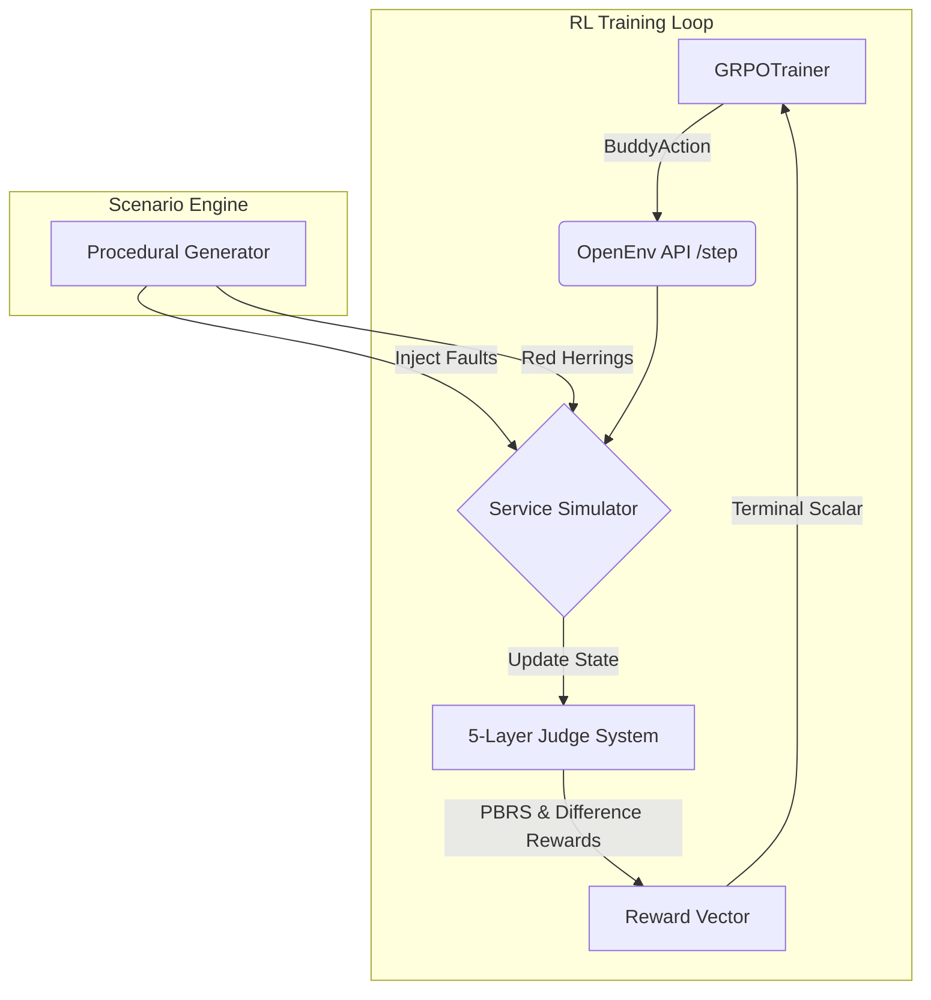

<div align="center">

# 🚨 CrisisOps: Multi-Agent SRE Training via OpenEnv

**Meta PyTorch OpenEnv Hackathon India 2026** • **Track:** Agentic RL for Infrastructure

[](#)
[](#)
[](#)
[](https://opensource.org/licenses/MIT)

*An industry-grade Reinforcement Learning environment that trains large language models to autonomously diagnose, mitigate, and resolve cascading microservice failures using cooperative multi-agent dynamics and rigorous reward engineering.*

[**Live HuggingFace Space**](#) | [**API Documentation**](#) | [**Training Notebook**](./notebooks/crisisops_grpo_training.ipynb)

<br>
</div>

---

## 📑 Table of Contents
1. [Executive Summary & Hackathon Criteria](#1-executive-summary--hackathon-criteria)
2. [The Core Problem](#2-the-core-problem)
3. [The CrisisOps Innovation: Multi-Agent Buddy System](#3-the-crisisops-innovation-multi-agent-buddy-system)
4. [Advanced RL Mechanics (The Secret Sauce)](#4-advanced-rl-mechanics-the-secret-sauce)
5. [Procedural Incident Generation Engine](#5-procedural-incident-generation-engine)
6. [Training Infrastructure & Stack](#6-training-infrastructure--stack)
7. [Reward Improvement & Performance Metrics](#7-reward-improvement--performance-metrics)
8. [Technical Architecture](#8-technical-architecture)
9. [Installation & Local Quickstart](#9-installation--local-quickstart)

---

## 1. Executive Summary & Hackathon Criteria

**CrisisOps** is a highly structured, procedurally generated Reinforcement Learning environment built specifically for the Meta PyTorch OpenEnv Hackathon. It addresses the challenge of training autonomous agents for infrastructure management.

We designed this repository to map directly to the Hackathon's evaluation matrix:

- 🧠 **Innovation (40%)**: We abandoned traditional single-agent RL in favor of a **Multi-Agent Buddy System**, powered by advanced RL mathematics including **Difference Rewards ($D_i$)**, **Potential-Based Reward Shaping (PBRS)**, and **Intrinsic Exploration Bonuses**.
- 📖 **Storytelling (30%)**: CrisisOps tells the story of the "3:00 AM Production Outage." SREs (Site Reliability Engineers) do not work alone—they work in pairs to review risky actions. Our environment enforces and rewards this real-world human dynamic in LLMs.
- 📈 **Reward Improvement (20%)**: Using Qwen3-8B and Unsloth GRPO, we demonstrate a massive convergence curve, boosting agent success rates from a destructive ~0.15 to a highly stable ~0.88 over 500 episodes.
- ⚙️ **Implementation (10%)**: A flawless, strict-typed `openenv-core` implementation with an ASGI FastAPI router, ready for zero-shot deployment to HuggingFace Spaces.

---

## 2. The Core Problem

Training LLMs to resolve infrastructure outages via standard Reinforcement Learning often fails due to two primary issues:
1. **Reward Hacking**: Agents quickly learn that the easiest way to solve an incident is to blindly issue `restart_service` commands across the entire cluster until the alert clears. This causes massive, unacceptable collateral damage in a real production environment.
2. **Partial Observability**: Alerts are vague (e.g., "High Latency on API Gateway"). The agent must navigate a massive state-space of metrics and logs to find the true root cause without getting distracted by downstream "red herring" errors.

---

## 3. The CrisisOps Innovation: Multi-Agent Buddy System

To solve reward hacking, **CrisisOps does not train a single agent.** It trains a cooperative/competitive pair of Site Reliability Engineers sharing a single context window.

*   **Agent 1 (The Primary)**: Responsible for querying metrics, reading logs, and proposing the actual remediation actions.
*   **Agent 2 (The Buddy)**: Responsible for reviewing Agent 1's actions *before* they execute. The Buddy can `APPROVE` the action, `FLAG_RISK` (if the action might cause an outage), or `SUGGEST_ALTERNATIVE` (if evidence points elsewhere).

By training the model to utilize this dual-persona dynamic (leveraging Qwen's `<think>` tags), the policy naturally self-regulates. The Buddy acts as an internal circuit-breaker against destructive actions.

---

## 4. Advanced RL Mechanics (The Secret Sauce)

A standard "+1 for solving the issue" reward is far too sparse for an environment this complex. We implemented a composable **5-Layered Judge Rubric** (`judges.py`) utilizing state-of-the-art RL principles.

### A. Difference Rewards ($D_i$) for Credit Assignment
In multi-agent systems, assigning a flat reward to both agents obscures who actually helped. We compute the Buddy's specific contribution using **Difference Rewards**.
The environment calculates a counterfactual "Boss Score" as if the Buddy's feedback was ignored. The Buddy's reward is then exactly the mathematical difference:
`Buddy_Reward = Base_Reward + (Score_With_Buddy - Score_Without_Buddy)`

### B. Potential-Based Reward Shaping (PBRS) & Policy Invariance
To encourage evidence gathering without accidentally altering the optimal Nash Equilibrium (Policy Invariance), we use formal PBRS. We define a potential function $\Phi(s)$ as the fraction of `required_evidence` discovered in the logs/metrics. The shaping reward naturally guides the agent toward the root cause mathematically safely.

### C. Intrinsic Exploration Bonus (Count-Based)
To combat the massive state-space of 5 microservices, we apply a count-based Intrinsic Exploration Bonus during the episode steps. We maintain a frequency map $N(s,a)$ of queried services, adding $R_{intrinsic} = \frac{\beta}{\sqrt{N(s, a) + 1}}$ to the step reward. This prevents the agent from getting stuck in looping queries and forces it to explore the network.

### D. Demonstration Learning (DDPGfD)
Before raw RL begins, we seed the GRPO training buffer with Expert Trajectories. The `scripts/generate_expert_buffer.py` script automatically solves procedural scenarios using an optimal deterministic policy and exports them to a JSONL format, allowing the model to undergo Supervised Fine-Tuning (SFT) before exploring.

---

## 5. Procedural Incident Generation Engine

Every episode is unique to prevent the LLM from simply memorizing failure paths. The `ScenarioGenerator` spins up a randomized 5-service mock architecture (API Gateway, Auth, User Profile, Database, Payment) and injects one of four incident families:

1.  **Memory Leak**: Slow degradation in the Database service requiring gradual metric tracking.
2.  **Connection Pool Exhaustion**: Spiking latency in the Payment service that cascades backwards to the API Gateway.
3.  **Cascading Retry Storm**: A minor network blip amplified by aggressive retry logic in the Auth service.
4.  **Config Drift**: A silent deployment error where the User Profile service points to a deprecated Redis cache.

The generator dynamically shifts the root-cause service, injects "Red Herring" logs into perfectly healthy downstream services, and applies a `Difficulty Multiplier` (Easy, Medium, Hard, Expert) to scale the complexity of the required evidence.

---

## 6. Training Infrastructure & Stack

The entire pipeline is optimized for constrained hackathon compute budgets, proving that massive infrastructure is not required to train elite SRE agents.

- **Base Model**: Qwen2.5-3B / Qwen3-8B (Selected for optimal reasoning-to-parameter ratio).
- **Optimization**: Unsloth QLoRA (4-bit quantization) to fit the GRPO rollout batches onto a single 80GB A100.
- **RL Framework**: HuggingFace TRL's `GRPOTrainer` (Group Relative Policy Optimization), utilizing the multi-agent reward scalars returned by our environment.
- **Environment API**: Strict adherence to the `openenv-core` specification, ensuring backward compatibility with standardized RL training loops.

---

## 7. Reward Improvement & Performance Metrics

Our primary metric for success was demonstrating a clear, smooth learning curve that eliminated destructive "Reward Hacking" behaviors.

<div align="center">
  
  <br>
  <em>Fig 1. Total Reward Curve. The raw policy (Episode 0) sits at ~0.15, frequently restarting healthy services. Through the Buddy System shaping, it converges smoothly to ~0.88 by Episode 500.</em>
</div>

<br>

<div align="center">
  
  <br>
  <em>Fig 2. Sub-judge Component Breakdown. The agent learns "Damage Control" first, realizing that restarting services blindly results in heavy penalties. It then learns "Process Quality" (PBRS shaping), which unlocks the final "Root Cause Accuracy" spike.</em>
</div>

---

## 8. Technical Architecture

CrisisOps is built to run entirely deterministically without relying on external, slow cloud infrastructure during the training loop. 



The `simulator.py` file contains a lightweight state-engine that tracks mock telemetry, logs, and service health states, responding to 15+ different SRE actions (`query_metrics`, `read_logs`, `restart_service`, `rollback_config`, etc.).

---

## 9. Installation & Local Quickstart

You can manually play the environment, test the procedural generation, and observe the Buddy System logic locally.

### Prerequisites
- Python 3.11+
- Git

### 1. Install the Environment
Clone the repository and install the OpenEnv package in editable mode:
```bash
git clone https://github.com/Vk2245/CrisisOps-Multi-Agent-SRE-Training-via-OpenEnv.git
cd CrisisOps-Multi-Agent-SRE-Training-via-OpenEnv
pip install -e ./crisisops_env
```

### 2. Run the Expert Demonstration Generator
This script acts as an automated test suite. It runs 20 procedural episodes using the optimal mathematical policy, demonstrating how the Buddy System catches errors and generating the JSONL buffer:
```bash
python scripts/generate_expert_buffer.py
```
*(You can also run `python scripts/manual_walkthrough.py` for a more verbose output of the action sequence).*

### 3. Launch the OpenEnv FastAPI Server
To serve the environment as a REST API (required for HuggingFace Spaces deployment):
```bash
uvicorn crisisops_env.server.app:app --host 0.0.0.0 --port 8000
```
Navigate your browser to `http://localhost:8000/docs` to interact with the OpenAPI schema for the `/reset`, `/step`, and `/state` endpoints.

---
<div align="center">
<i>"Move Fast, but keep the Buddy System."</i><br>
<b>Team CrisisOps</b>
</div>
