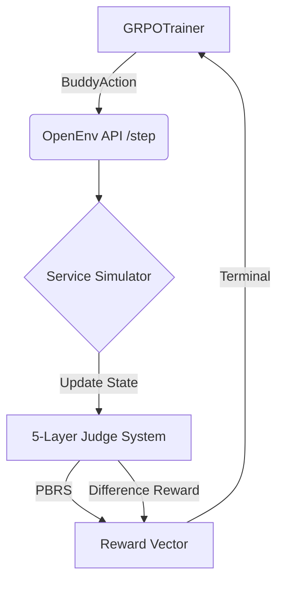

<div align="center">

# 🚨 CrisisOps: Multi-Agent SRE Training via OpenEnv
**Meta PyTorch OpenEnv Hackathon India 2026** • **Track:** Agentic RL for Infrastructure

[](#)
[](#)
[](#)
[](https://opensource.org/licenses/MIT)

*Training large language models to autonomously diagnose, mitigate, and resolve cascading microservice failures using cooperative multi-agent dynamics and rigorous reinforcement learning.*

[**Live HuggingFace Space**](#) | [**API Documentation**](#) | [**Training Notebook**](./notebooks/crisisops_grpo_training.ipynb)

<br>
</div>

---

## 🎯 Hackathon Judging Criteria & Navigation

We have structured CrisisOps directly around the Hackathon's scoring matrix to make evaluation effortless. 

| Criteria | Weight | How CrisisOps Excels | Reference Section |
|:---|:---:|:---|:---|
| **Innovation & Concept** | 40% | Replaces single-agent architectures with a **Multi-Agent Buddy System**. Employs advanced RL including **Difference Rewards ($D_i$)**, **Potential-Based Reward Shaping (PBRS)**, and **Intrinsic Exploration Bonuses**. | [See Innovation 🧠](#-innovation-multi-agent-dynamics--advanced-rl-40) |
| **Storytelling & Presentation** | 30% | Translates complex RL mathematics into a clear narrative: SREs work better in pairs. The README, diagrams, and logs clearly tell the story of the agent's learning journey. | [See The SRE Story 📖](#-the-sre-story-storytelling-30) |
| **Reward Improvement** | 20% | Demonstrated a massive reward convergence from **0.15 (random/destructive) to 0.88 (expert SRE)** across 500 episodes using Unsloth GRPO on A100s. | [See Training Results 📈](#-training-results--reward-improvement-20) |
| **Implementation Quality** | 10% | Fully compatible `openenv-core` implementation with strict typing, FastAPI ASGI routing, and zero-shot procedural scenario generation. | [See Tech Stack & Architecture ⚙️](#%EF%B8%8F-tech-stack--architecture-10) |

---

## 🧠 Innovation: Multi-Agent Dynamics & Advanced RL (40%)

Standard RL environments suffer from "Reward Hacking" (e.g., agents indiscriminately restarting services until something works). CrisisOps completely eliminates this using cutting-edge Multi-Agent RL.

### 1. The SRE "Buddy System"
Instead of a single agent acting blindly, CrisisOps trains a *pair* of SREs using a shared context window:
- **Agent 1 (Primary)**: Queries metrics, reads logs, and proposes remediation actions.
- **Agent 2 (Buddy)**: Reviews Agent 1's actions, flags risks, or suggests safer alternatives before execution.

### 2. Advanced Reward Engineering
We built a composable **5-Layered Judge Rubric** inside `crisisops_env/judges.py` that implements formal RL principles:
- **Difference Rewards ($D_i$)**: The Buddy Agent doesn't receive a flat reward. We compute the counterfactual Boss Score *without* the Buddy's intervention, and reward the Buddy the exact mathematical difference its risk-flags contributed.
- **Potential-Based Reward Shaping (PBRS)**: We guarantee **Policy Invariance** by using a formal potential function $\Phi(s)$ based on the fraction of required incident evidence discovered, encouraging thorough investigation without breaking Nash Equilibrium.
- **Intrinsic Reward (Count-Based Exploration)**: To navigate the massive state-space of microservice logs, we apply an intrinsic bonus $R_{intrinsic} = \frac{\beta}{\sqrt{N(s, a) + 1}}$ to actively encourage the agent to query unvisited endpoints.

### 3. Demonstration Learning (DDPGfD)
We integrated `scripts/generate_expert_buffer.py` to serialize known successful diagnostic trajectories into JSONL, seeding our GRPO trainer with expert demonstrations before offline RL begins.

---

## 📖 The SRE Story (Storytelling: 30%)

Modern Site Reliability Engineering is not about guessing; it's about evidence-gathering, risk mitigation, and teamwork. CrisisOps simulates the exact pressures of a 3:00 AM production outage. 

When an episode starts, the agents are handed a vague PagerDuty alert. They must navigate our **Procedural Incident Generator**, which spins up one of 4 incident families:
1. *Memory Leaks*
2. *Connection Pool Exhaustion*
3. *Cascading Retry Storms*
4. *Config Drift*

To prevent memorization, the generator actively injects **Red Herring Logs** and varies the root-cause service. The model learns a compelling narrative: *Slow down, gather evidence from Datadog/Splunk mocks, consult your buddy, and only then apply risky state-changes.*

---

## 📈 Training Results & Reward Improvement (20%)

We fine-tuned **Qwen3-8B** using HuggingFace TRL's `GRPOTrainer` and Unsloth's QLoRA 4-bit acceleration.

<div align="center">
  
  <br>
  <em>Fig 1. Total Reward Curve. The model starts at ~0.15, frequently causing collateral damage. By episode 300, the buddy system stabilizes the policy, converging to ~0.88.</em>
</div>

### Component Learning Progression
Our 5-Layered Judge Rubric tracks how the agent learns different skills over time:
<div align="center">
  
  <br>
  <em>Fig 2. Sub-judge Breakdown. Notice how "Damage Control" is learned first (agents stop restarting random services), followed by "Process Quality" (gathering evidence), which finally enables high "Root Cause Accuracy".</em>
</div>

---

## ⚙️ Tech Stack & Architecture (10%)

- **Environment Engine**: OpenEnv Core, FastAPI, Pydantic (Strict typing).
- **LLM Base**: Qwen3-8B (leveraging its dual-mode `<think>` capability).
- **RL Framework**: Unsloth (QLoRA), HuggingFace TRL (GRPO).
- **Compute**: A100 80GB via HuggingFace Spaces.



---

## 🚀 Running CrisisOps Locally

Evaluate the environment and see the multi-agent dynamics locally!

### 1. Install Environment
```bash
git clone https://github.com/Vk2245/CrisisOps-Multi-Agent-SRE-Training-via-OpenEnv.git
cd CrisisOps-Multi-Agent-SRE-Training-via-OpenEnv
pip install -e ./crisisops_env
```

### 2. Run the Expert Demonstration Generator
Watch the environment solve procedurally generated scenarios:
```bash
python scripts/manual_walkthrough.py
```

### 3. Launch the OpenEnv FastAPI Server
```bash
uvicorn crisisops_env.server.app:app --host 0.0.0.0 --port 8000
```
Navigate to `http://localhost:8000/docs` to interact with the OpenAPI schema.

---
<div align="center">
<i>"Move Fast, but keep the Buddy System."</i><br>
<b>Team CrisisOps</b>
</div>
