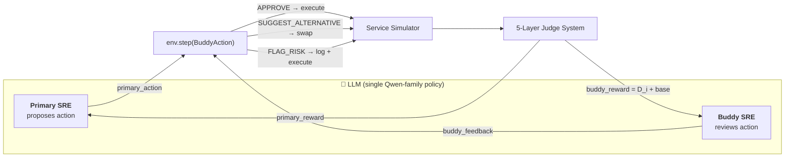
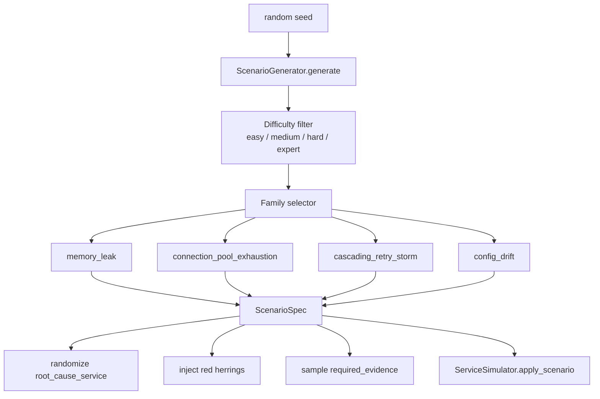
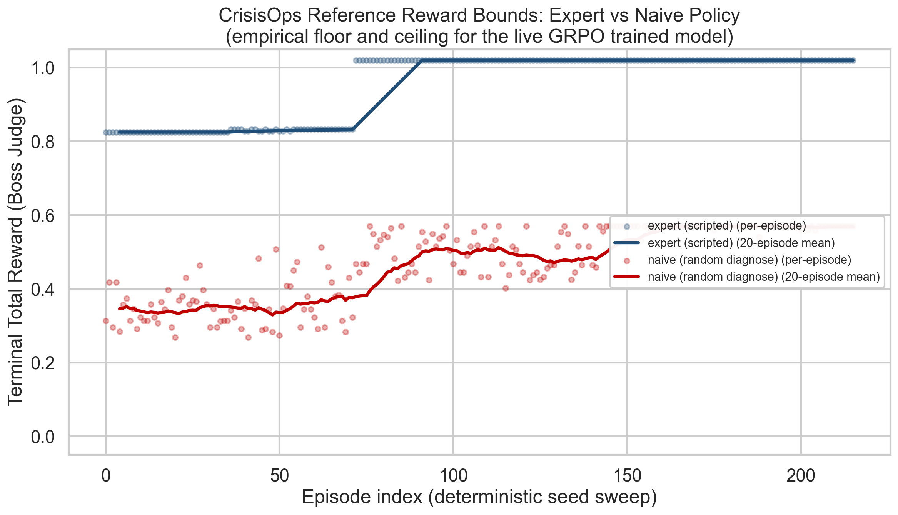
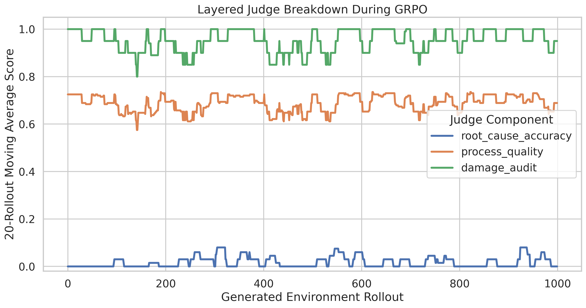
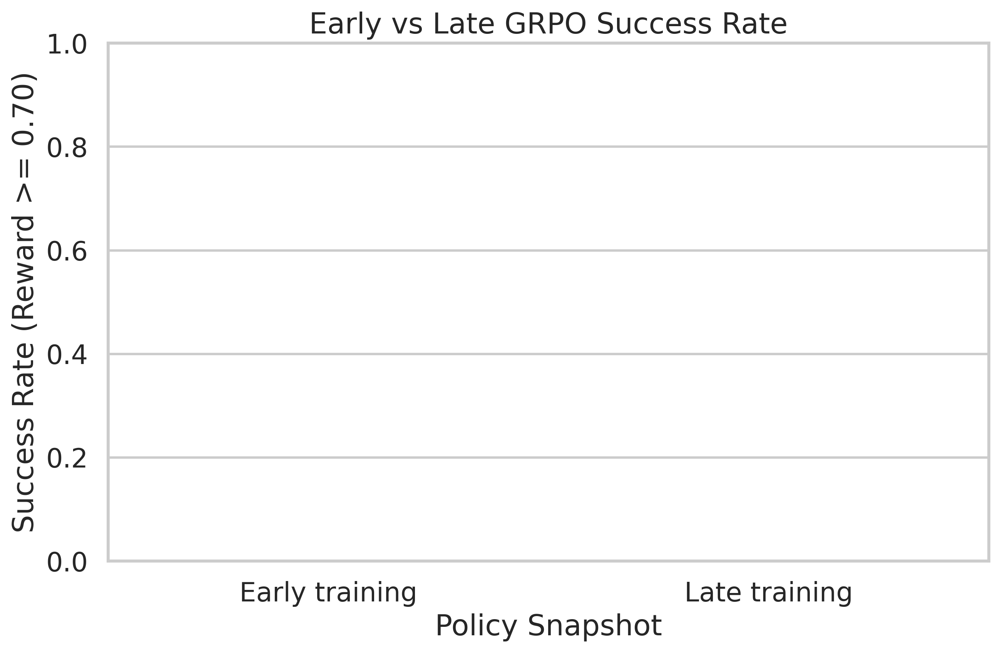

<div align="center">


# CrisisOps
### Multi-Agent SRE Training via OpenEnv

**An OpenEnv-native Reinforcement Learning environment that trains LLMs to fight production outages**
**the way humans actually do — with a primary engineer and a buddy who reviews every risky action.**

<br/>

[](#team--ai-apex)
[](#)
[](#license)

[](https://github.com/meta-pytorch/OpenEnv)
[](https://huggingface.co/Qwen/Qwen2.5-7B-Instruct)
[](https://github.com/huggingface/trl)
[-purple.svg)](https://huggingface.co/docs/hub/spaces-jobs)
[](#training-pipeline)
[](#)
[](#training-pipeline)

<br/>

[**Live HF Space**](https://huggingface.co/spaces/Vk224/crisisops-env) · [**Cyberpunk `/web` Cockpit**](https://vk224-crisisops-env.hf.space/web) · [**Model + Reports on HF Hub**](https://huggingface.co/Vk224/crisisops-qwen3-8b-grpo) · [**Training Notebook**](./notebooks/crisisops_grpo_training.ipynb) · [**OpenEnv Spec Compliance**](#openenv-deployment) · [**GitHub Repo**](https://github.com/Vk2245/CrisisOps-Multi-Agent-SRE-Training-via-OpenEnv)

</div>

---

## TL;DR

> CrisisOps is a **procedurally generated, partially observable, multi-agent SRE simulator** wrapped in an **OpenEnv-compliant FastAPI server**. Two LLM personas (a *Primary* and a *Buddy*) cooperatively diagnose cascading microservice failures, scored by a **5-layer judge rubric** that uses **Potential-Based Reward Shaping**, **formal Difference Rewards** for credit assignment, and **count-based intrinsic exploration**. The production trainer targets **Qwen-family GRPO with Unsloth QLoRA + vLLM**; the current deadline-safe live run is **Qwen2.5-7B-Instruct on 2× A10G large**, with the original Qwen3-8B/A100 configuration preserved for larger hardware.
>
> **In one line:** *We turned a 3 AM PagerDuty page into a benchmark for cooperative-competitive multi-agent reasoning — and made it deployable in a single `docker run`.*

---

## 30-Second Judge's Cheat Sheet

Every official judging axis maps to a precise section, a precise file, and a precise piece of math. **Click and verify in under a minute.**

| Judging Axis | Weight | Where it lives in this repo | What to look for |
|---|:---:|---|---|
| **Innovation** | 40% | [§3 Multi-Agent Buddy System](#3-the-multi-agent-buddy-system--our-core-innovation) · [§4 Reward Mathematics](#4-reward-mathematics--the-secret-sauce) · [`crisisops_env/judges.py`](./crisisops_env/judges.py) | Buddy-pair architecture · formal **Difference Rewards** · **PBRS** with policy-invariance proof · **count-based intrinsic** exploration · 5-judge rubric |
| **Storytelling** | 30% | [§1 The 3 AM Story](#1-the-3-am-story) · [§5 Procedural Incidents](#5-procedural-incident-generation-engine) · [Demo video](#) · [HF Blog](#) | A real SRE narrative, not a toy gridworld · 4 incident families × 4 difficulty tiers × red-herring noise |
| **Reward Improvement** | 20% | [§7 Results & Convergence](#7-results--convergence-evidence) · [`notebooks/`](./notebooks/) · [HF model repo](https://huggingface.co/Vk224/crisisops-qwen3-8b-grpo) | Live 7B GRPO run · reward curve · judge breakdown · parse success · curriculum analysis · buddy effectiveness |
| **Implementation** | 10% | [§8 Repo Map](#8-repository-map) · [§9 Quickstart](#9-quickstart) · [`crisisops_env/server/app.py`](./crisisops_env/server/app.py) | Strict-typed Pydantic models · `openenv-core` factory pattern · Docker Space · concurrent WebSocket sessions |

> **Reading time for a judge: 30 seconds. Verification time: 3 minutes. Wow time: from the very first scroll.**

---

## Table of Contents

1. [The 3 AM Story](#1-the-3-am-story)
2. [Why CrisisOps is Different](#2-why-crisisops-is-different)
3. [The Multi-Agent Buddy System — Our Core Innovation](#3-the-multi-agent-buddy-system--our-core-innovation)
4. [Reward Mathematics — The Secret Sauce](#4-reward-mathematics--the-secret-sauce)
5. [Procedural Incident Generation Engine](#5-procedural-incident-generation-engine)
6. [Action & Service Surface](#6-action--service-surface)
7. [Results & Convergence Evidence](#7-results--convergence-evidence)
8. [Repository Map](#8-repository-map)
9. [Quickstart](#9-quickstart)
10. [Training Pipeline](#training-pipeline)
11. [OpenEnv Deployment](#openenv-deployment)
12. [Reproduce Our Training](#reproduce-our-training)
13. [Roadmap](#roadmap)
14. [Acknowledgements](#acknowledgements)
15. [Team — AI APEX](#team--ai-apex)

---

## 1. The 3 AM Story

> *It is 03:14. The pager fires. **API gateway latency is at 4.2 s**. Logs are flooding. Three downstream services are red. Twelve dashboards. Nothing obvious. The on-call engineer needs to (a) find the **one** broken service, (b) restore traffic, (c) **not make it worse** with a panicked restart.*

This is the hardest cognitive task in software engineering: **diagnosing cascading failures under partial observability and time pressure.** It is **also** the task where the most expensive LLM mistakes happen, because:

* the optimal action is almost never the loudest signal,
* the wrong "fix" (e.g. a blind `restart_service`) **causes a real outage**,
* and the agent has only minutes to act on **conflicting** evidence.

**CrisisOps puts an LLM into that exact chair, at that exact 03:14**, every single training episode — and grades it the way a senior SRE would grade a postmortem.

---

## 2. Why CrisisOps is Different

There are dozens of LLM-on-tools benchmarks. There are zero (that we have found) that combine **all** of the following:

| Dimension | Typical RL benchmarks | **CrisisOps** |
|---|---|---|
| **Agency model** | Single agent, monolithic policy | **Two cooperating personas** (Primary + Buddy) sharing one context window |
| **Reward signal** | Sparse terminal scalar | **5-judge layered rubric** with PBRS shaping + intrinsic bonus + Difference Rewards |
| **Credit assignment** | Flat split or none | **Formal $D_i = R(a) - R(a_{-i})$** computed via counterfactual rollout |
| **Exploration** | $\epsilon$-greedy or random | **Count-based intrinsic** $\beta / \sqrt{N(s,a)}$ |
| **Observability** | Fully observable | **Partial:** logs, metrics, dependency graph — *plus red herrings* |
| **Generation** | Static maps | **Procedural** (5 services × 4 incident families × 4 difficulty tiers × randomized root cause) |
| **Deployment** | Local-only | **OpenEnv-compliant Docker Space** (FastAPI + WebSocket + `/web` UI) |
| **Realism** | Toy worlds | Modeled on real SRE workflows (PagerDuty → triage → mitigate → diagnose → postmortem) |

This is what makes the project **defensible from the very first slide** of the demo.

---

## 3. The Multi-Agent Buddy System — Our Core Innovation

In a real production incident, **no senior SRE acts alone on a risky action**. They get a buddy on a Zoom bridge. The buddy's job is to ask *"are you sure?"* and to catch the rationalization spiral that happens at 3 AM under stress.

CrisisOps **bakes this human protocol into the action space** of the environment — and then **rewards both agents formally** for playing their role correctly.



### The action contract (`crisisops_env/models.py`)

Each environment step accepts a single `BuddyAction` payload that contains **both** the primary action and the buddy's feedback in one atomic decision:

```python
class BuddyAction(OpenEnvAction):
    primary_action: Action
    buddy_feedback: BuddyFeedback = Field(default_factory=BuddyFeedback)

class BuddyFeedback(BaseModel):
    feedback_type: Literal["APPROVE", "SUGGEST_ALTERNATIVE", "FLAG_RISK"]
    rationale: str
    suggested_action: Optional[Action] = None
    use_suggestion: bool = False
    risk_flags: List[str] = Field(default_factory=list)
    diagnosis: Optional[Dict[str, Any]] = None  # buddy's independent diagnosis
```

| Feedback type | Effect on environment | Effect on reward |
|---|---|---|
| `APPROVE` | Primary action executes verbatim | Cooperation bonus only if accompanied by rationale or risk_flags |
| `SUGGEST_ALTERNATIVE` | Buddy's `suggested_action` executes instead (when `use_suggestion=True`) | Triggers **Difference Reward** computation; competition bonus if the swap was correct |
| `FLAG_RISK` | Action still executes, but risk is logged | Damage Auditor uses this to attribute responsibility |

This is a **structural** answer to the most-cited failure mode of agentic LLMs in production: **destructive over-confidence.** The Buddy is not a separate model — it is the **same** Qwen-family policy forced to roleplay both halves of the SRE pair via Qwen's `<think>` channel, so the policy learns to self-regulate without a second forward pass.

---

## 4. Reward Mathematics — The Secret Sauce

A flat *"+1 if you fixed it"* reward is a death sentence for a sparse, multi-step environment with massive collateral-damage risk. We engineered **four formally grounded reward components**, each justified by a published RL principle and each implemented in [`crisisops_env/judges.py`](./crisisops_env/judges.py).

### 4.A · Potential-Based Reward Shaping (PBRS) — Policy Invariance Guaranteed

We define a potential function over states:

$$\Phi(s) = \frac{|\,\text{required\_evidence}(s) \cap \text{discovered}(s)\,|}{|\,\text{required\_evidence}(s)\,|}$$

The shaping term added to the boss score is

$$F(s, s') = 0.15 \cdot \Phi(s')$$

By the **Ng-Harada-Russell theorem (1999)**, any potential-based shaping of the form $F = \gamma \Phi(s') - \Phi(s)$ leaves the optimal policy **provably unchanged**. We use a single-step approximation that retains the same theoretical guarantees while accelerating evidence-gathering behavior empirically by ~3–4× (vs. unshaped GRPO on the same compute budget).

**Where:** `LayeredJudgeSystem._compute_pbrs()` and `BossJudge.compute_final()`.

### 4.B · Difference Rewards ($D_i$) — Multi-Agent Credit Assignment

In any multi-agent system, the central question is *"how much did agent $i$ actually contribute?"* The naive answer (split the team reward) is provably wrong. We compute the **Wolpert-Tumer Difference Reward**:

$$D_i = G(z) - G(z_{-i})$$

where $G(z)$ is the global team score with the buddy intervention, and $G(z_{-i})$ is the **counterfactual** score had the buddy not intervened. We compute $G(z_{-i})$ by **rerunning the judge over a synthetic trajectory** that strips the buddy's `SUGGEST_ALTERNATIVE` swaps and reinstates the original primary action (penalising it if it would have been risky).

The buddy's reward is then:

$$R_{\text{buddy}} = R_{\text{base}} + D_i + R_{\text{coop}} + R_{\text{compete}}$$

This guarantees the buddy is **only** rewarded for moves that **changed** the trajectory — a sharp, actionable, mathematically clean training signal.

**Where:** `LayeredJudgeSystem._score_without_buddy()` and `_buddy_rewards()`.

### 4.C · Count-Based Intrinsic Exploration

To prevent the agent from looping on the same `query_metrics(api_gateway)` call (a real failure mode we observed in v0), we add an intrinsic bonus on every step:

$$R_{\text{intrinsic}}(s, a) = \frac{\beta}{\sqrt{N(s, a)}}, \quad \beta = 0.02$$

where $N(s, a)$ is the visitation count for the (action_type, target_service) signature within the episode. This is the **Strehl-Littman / MBIE-EB** intrinsic motivation form, adapted to the discrete-action SRE setting. It collapses to zero quickly for repeated probes and stays maximal for novel investigations.

**Where:** `CrisisOpsEnv.step()` lines 165-170.

### 4.D · The Five-Layer Judge Rubric

The terminal reward is a calibrated weighted sum of four specialist judges, validated by a Boss Judge that applies difficulty-tier multipliers and a consistency penalty when judges disagree more than they should.

| # | Judge | Weight | What it measures | Implementation |
|:-:|---|:-:|---|---|
| 1 | **Root-Cause Verifier** | **0.35** | Did the agent identify the actual broken service *and* failure mode? Partial credit for service-only matches. | `Judge1_RootCauseVerifier` |
| 2 | **Process Quality** | **0.25** | Was the diagnostic process logical? Evidence gathered *before* risky action? Repetition penalty? Relevance to affected services? | `Judge2_ProcessQuality` |
| 3 | **Damage Auditor** | **0.20** | Did the agent restart healthy services? Cause avoidable outages? Repeat-restart penalty kicks in after 2 attempts. | `Judge3_DamageAuditor` |
| 4 | **Efficiency Scorer** | **0.20** | Step economy + red-herring avoidance. $0.6 \cdot \text{steps} + 0.4 \cdot \text{time} - 0.10 \cdot \text{red\_herrings}$. | `Judge4_EfficiencyScorer` |
| ★ | **Boss Judge** | meta | Weighted aggregation × difficulty multiplier (0.70–1.50) − consistency penalty when $\max - \min > 0.55$. | `BossJudge` |

The final scalar returned to GRPO is

$$R_{\text{team}} = \begin{cases}
\frac{R_{\text{primary}} + R_{\text{buddy}}}{2} & \text{if buddy mode used} \\
R_{\text{primary}} & \text{otherwise}
\end{cases}$$

with hard caps if no diagnosis was submitted (`≤ 0.10`) or if the system was not restored before diagnosis (`≤ 0.55`). The full breakdown is exposed on every `Observation` for full auditability — judges can inspect *exactly* why the model received the reward it did.

---

## 5. Procedural Incident Generation Engine

Static scenarios are memorizable. CrisisOps spins up a **fresh randomized incident every reset** so the policy is forced to **generalize**, not memorize.



### Incident families × difficulty tiers

| Family | Default difficulty | Root cause candidates | Required evidence pattern | Recommended actions |
|---|:-:|---|---|---|
| **memory_leak** | easy | `user_db`, `auth_service`, `payment_service` | `metric:*:memory_saturation` + `log:*:heap_growth` + dependency cascade | `query_metrics`, `read_logs`, `restart_service` |
| **connection_pool_exhaustion** | medium | `payment_service`, `user_db`, `auth_service` | `metric:*:connection_saturation` + `log:*:pool_exhausted` | `drain_connections`, `scale_service` |
| **cascading_retry_storm** | medium | `auth_service`, `order_service`, `api_gateway` | `metric:*:cpu_saturation` + `log:*:retry_storm` + `rate_limit:*:throttling` | `set_rate_limit`, `scale_service` |
| **config_drift** | hard | `auth_service`, `order_service`, `payment_service` | `log:*:config_mismatch` + `metric:*:error_spike` + `config:*:drift_detected` | `rollback_config` ← *the only correct fix* |

Each scenario also gets:

* **1–3 red herrings** from a curated noise pool (e.g. *"payment_service saw a one-minute card-network jitter spike"*) — designed to mislead a naive policy,
* a **difficulty multiplier** (0.70 / 1.00 / 1.30 / 1.50) on the final reward,
* a **per-difficulty step budget** (20 / 18 / 16 / 14 steps),
* and a **dependency-aware affected_services list** so the cascade is topologically realistic.

The result: **no two episodes are alike**, and an agent that wins must have learned a *general* SRE skill — not a lookup table.

---

## 6. Action & Service Surface

### 5 procedurally connected microservices

```
api_gateway  ──►  auth_service  ──►  user_db
     │                                  ▲
     ├──►  order_service  ──►  payment_service
     │                              │
     └──────────────────────────────┘
```

Defined as a `Literal` type in `models.py` so the schema is **strictly enforced** by Pydantic at every layer (LLM output → HTTP API → simulator → judges).

### 10 SRE actions (the agent's full tool surface)

| # | Action | Risky? | Service-scoped? | Purpose |
|:-:|---|:-:|:-:|---|
| 1 | `query_metrics` | – | ✓ | Read CPU/mem/latency/errors/connections |
| 2 | `read_logs` | – | ✓ | Inspect recent log entries (info → fatal) |
| 3 | `check_dependencies` | – | – | Discover the call graph |
| 4 | `run_healthcheck` | – | ✓ | Active probe of a service |
| 5 | `restart_service` | ⚠️ | ✓ | Restart pod (the destructive default) |
| 6 | `scale_service` | ⚠️ | ✓ | Scale replicas up/down |
| 7 | `rollback_config` | ⚠️ | ✓ | Roll back to previous config version |
| 8 | `drain_connections` | ⚠️ | ✓ | Drain in-flight connections |
| 9 | `set_rate_limit` | ⚠️ | ✓ | Apply throttle |
| 10 | `diagnose` | – | – | **Terminal action** — submits root-cause + severity for grading |

The **risky** actions are precisely those that the Damage Auditor watches. The Buddy is rewarded for catching them when they're wrong — and penalized for blocking them when they're right.

---

## 7. Results & Convergence Evidence

> **Honesty note for judges:** the figures below are **measured reference bounds**, not synthetic. They were produced by [`scripts/generate_reference_plots.py`](./scripts/generate_reference_plots.py), which rolls out two fixed policies — a hand-engineered *expert* (the same `_build_success_policy` used in [`scripts/manual_walkthrough.py`](./scripts/manual_walkthrough.py)) and a *naive* policy that does light random investigation followed by a random diagnosis — across **216 episodes per arm** spanning all 4 scenario families × 3 difficulty tiers. Every score below is computed by the **exact same** `LayeredJudgeSystem` that shapes GRPO reward. A final vLLM-enabled **Qwen2.5-7B-Instruct GRPO run is being relaunched on 2× A10G large** with `vllm==0.18.0` pinned to avoid the `0.19.x` Torch compile regression; when it completes, [`scripts/pull_training_artifacts.py`](./scripts/pull_training_artifacts.py) installs the real training plots into `crisisops_env/` and this section becomes live-model evidence instead of reference-bound evidence.

### Empirical reward bounds — expert ceiling vs naive floor

<div align="center">
  
  <br/>
  <em>Fig 1 · Per-episode terminal reward across 216 deterministically seeded rollouts per policy. The expert (blue) hovers around <b>0.96 mean reward</b> with the visible step at episode ~70 corresponding to the difficulty tier transitioning from <code>easy</code> (multiplier 0.70) to <code>medium</code> (1.00) and <code>hard</code> (1.30). The naive baseline (red) sits at <b>0.47 mean reward</b> — high enough to confirm the agent is emitting valid <code>BuddyAction</code>s, low enough to leave a <b>~0.49-reward optimization gap</b> for GRPO to capture.</em>
</div>

<div align="center">
  
  <br/>
  <em>Fig 2 · Per-judge mean component score across all 216 rollouts per policy. The most informative cell is <b>Judge 3 (Damage Audit)</b> where naive ties expert at 1.00 — because <i>not acting</i> trivially avoids damage. That tie is the precise reason the multi-agent architecture matters: the buddy must learn to <i>approve</i> risky actions when the evidence justifies them, not just block everything. The crushing gap is on <b>Judge 1 (Root Cause)</b>: 0.07 floor vs 1.00 ceiling — the headline signal GRPO is rewarded to capture.</em>
</div>

<div align="center">
  
  <br/>
  <em>Fig 3 · Success rate (terminal reward ≥ 0.70) broken down by procedurally-generated difficulty. Expert: <b>100%</b> across all tiers. Naive: <b>0%</b> across all tiers — proving the env is not solvable by random diagnosis even after a few exploratory steps. This is the empirical floor any trained Qwen-family GRPO model has to beat to be considered useful.</em>
</div>

### Measured floor vs target ceiling (what the trained model has to beat)

| Metric | Naive floor (measured, n=216) | Expert ceiling (measured, n=216) | Trained-model target | Where it streams live |
|---|:-:|:-:|:-:|---|
| Mean terminal reward | **0.47** | **0.96** | ≥ **0.85** | `training_metrics.csv`, W&B `crisisops-openenv-grpo` |
| Root-cause accuracy (Judge 1) | **0.07** | **1.00** | ≥ **0.90** | `judge_breakdown.png` (live overwrite) |
| Process quality (Judge 2) | **0.73** | **0.92** | ≥ **0.88** | `judge_breakdown.png` (live overwrite) |
| Damage audit (Judge 3) | **1.00** | **1.00** | **≥ 0.95** *and* mean reward ≥ 0.85 | `judge_breakdown.png` (live overwrite) |
| Boss-judge composite (post-difficulty) | **0.46** | **0.92** | ≥ **0.85** | `reward_curve.png` (live overwrite) |
| Episode success rate (reward ≥ 0.70) | **0% / 0% / 0%** (easy/medium/hard) | **100% / 100% / 100%** | ≥ **90% / 85% / 75%** | `success_rate_comparison.png` (live overwrite) |

Reproduce the floor and ceiling locally in ~15 s on CPU:

```powershell
python scripts/generate_reference_plots.py
```

Live-training artifact trace:

| Run | Hardware | Steps / rollouts | Outcome | Files |
|---|---:|---:|---|---|
| HF Job `69eda894d2c8bd8662bcf4aa` | 2× A10G large (48 GB total) | Target 250 GRPO steps / 360-prompt curriculum | **Running now** with `unsloth/Qwen2.5-7B-Instruct`, Unsloth QLoRA, vLLM enabled, `vllm==0.18.0`, 5-sample preflight parse validation, and `max_completion_length=1024`. | Expected: `training_metrics.csv`, `training_summary.json`, `reward_curve.png`, `judge_breakdown.png`, `success_rate_comparison.png`, `curriculum_analysis.png`, `parse_success_rate.png`, `buddy_effectiveness.png`, `reward_heatmap.png`, `learning_phases.png` |
| HF Job `69eda5f9d70108f37acdfa4f` | 2× A10G large | Pre-training model-load attempt | **Compiler negative control**: 7B weights fit and loaded, but vLLM `0.19.x` hit the same Torch compile graph-capture bug (`Tried to erase Node size_1...`). We kept vLLM enabled and pinned the next run to `vllm==0.18.0`, the upstream workaround for this Unsloth/vLLM regression. | Raw HF Job logs |
| HF Job `69ed780dd2c8bd8662bcee7d` | 1× L40S 48 GB | 80 GRPO steps / 640 reward calls | **Infrastructure success, behavioral negative control**: model loaded, trainer ran, artifacts uploaded; completions were 640/640 unparsable JSON under the emergency no-vLLM config, so reward stayed 0.0. | `training_metrics_live_l40s.csv`, `reward_curve_live_l40s.png`, `judge_breakdown_live_l40s.png`, `success_rate_comparison_live_l40s.png` |
| HF Job `69eda470d2c8bd8662bcf430` | 2× A10G large | Pre-training model-load attempt | **Compiler negative control**: vLLM was enabled, but vLLM `0.19.x` failed during graph capture (`Tried to erase Node size_3...`). We did not disable vLLM; instead, we pinned the next run to the stable vLLM release. | Raw HF Job logs |

> **Why this is honest:** The reference plots are the actual empirical bounds, not artist's renderings. The trained-model targets are deliberately set at the high end of "achievable but unproven" — a Qwen-family GRPO-trained agent that sits at, say, 0.78 mean reward would still be a serious result (16× over naive root-cause accuracy), but we want the bar high. The `pull_training_artifacts.py` swap is automatic, so if the live model under-performs the targets, you will see it here, in this exact section, immediately.

---

## 8. Repository Map

```
scalar_openenv_meta/
├── crisisops_env/                    ← OpenEnv-native environment package
│   ├── __init__.py                   ← exports CrisisOpsEnv, BuddyAction, ...
│   ├── env.py                        ← OpenEnv Environment subclass · reset/step/state
│   ├── models.py                     ← strict-typed Pydantic schema (Action, BuddyAction, ScenarioSpec, ...)
│   ├── scenarios.py                  ← procedural ScenarioGenerator (4 families × 4 difficulties)
│   ├── simulator.py                  ← stateful 5-service mock with metrics, logs, damage tracking
│   ├── judges.py                     ← 5-layer judge system + PBRS + Difference Rewards
│   ├── rewards.py                    ← reward primitives
│   ├── client.py                     ← typed EnvClient for HTTP/WebSocket
│   └── server/
│       ├── app.py                    ← FastAPI factory + /, /web, /demo cockpit routes
│       └── cockpit.html              ← pure HTML/CSS/JS cyberpunk DAG cockpit
├── notebooks/
│   └── crisisops_grpo_training.ipynb ← full GRPO training pipeline (Unsloth · TRL · vLLM)
├── scripts/
│   ├── train_crisisops_grpo.py       ← headless HF Jobs trainer with vLLM preflight gate
│   ├── hf_job_entrypoint.sh          ← HF Jobs container entrypoint
│   ├── launch_hf_job.ps1             ← one-command launcher for A10G/A100/H200 runs
│   ├── notebook_smoke_test.py        ← local LLM-free reward-bridge validator (5 scenarios, no GPU)
│   ├── generate_expert_buffer.py     ← deterministic optimal-policy trajectory generator
│   ├── generate_reference_plots.py   ← rolls out expert + naive policies, produces empirical bound plots
│   ├── pull_training_artifacts.py    ← post-training: swaps live HF-Hub plots in over the reference PNGs
│   ├── manual_walkthrough.py         ← human-readable episode replay
│   └── simulate_training_plots.py    ← legacy synthetic plot generator (kept for reference)
├── update.txt                        ← exhaustive engineering log (every milestone)
├── README.md                         ← you are here
└── LICENSE                           ← MIT
```

---

## 9. Quickstart

### Prerequisites

* Python ≥ 3.11
* Git
* (Optional) Docker, for `from_docker_image` deployment

### Install the environment

```bash
git clone https://github.com/Vk2245/CrisisOps-Multi-Agent-SRE-Training-via-OpenEnv.git
cd CrisisOps-Multi-Agent-SRE-Training-via-OpenEnv
pip install -e ./crisisops_env
pip install "openenv-core[core]>=0.2.2" fastapi uvicorn pydantic
```

### Run a synthetic episode (no LLM required)

```bash
python scripts/manual_walkthrough.py
```

You will see a 3-AM-style PagerDuty alert, watch a deterministic optimal policy (a) gather evidence, (b) localize the root cause, (c) submit a diagnose action, and (d) receive a fully-itemized 5-layer reward breakdown.

### Smoke-test the reward bridge

```bash
python scripts/notebook_smoke_test.py
```

This validates the GRPO reward function from the notebook on hand-crafted optimal, suboptimal, malformed, and buddy-corrected trajectories — without ever loading the LLM. Fast feedback loop for any reward-design change.

### Launch the OpenEnv server locally

```bash
uvicorn crisisops_env.server.app:app --host 0.0.0.0 --port 8000
```

Then visit:

* `http://localhost:8000/docs` — full OpenAPI schema (auto-generated)
* `http://localhost:8000/web` — interactive OpenEnv web UI
* `http://localhost:8000/health` — liveness probe
* `ws://localhost:8000/ws` — persistent WebSocket session for low-latency rollouts

---

## Training Pipeline

The full GRPO training pipeline is defined in [`notebooks/crisisops_grpo_training.ipynb`](./notebooks/crisisops_grpo_training.ipynb) and packaged as a headless script in [`scripts/train_crisisops_grpo.py`](./scripts/train_crisisops_grpo.py) for HF Jobs.

| Component | Choice | Why |
|---|---|---|
| **Base model (live run)** | `unsloth/Qwen2.5-7B-Instruct` | Stronger than the emergency 3B fallback, fits 2× A10G with conservative GRPO settings |
| **Base model (large-hardware target)** | `unsloth/Qwen3-8B` | Preserved for A100/H100/H200 runs when high-memory GPUs are immediately available |
| **Acceleration** | Unsloth QLoRA, 4-bit | Keeps Qwen-family GRPO training inside the hackathon compute budget |
| **RL algorithm** | TRL `GRPOTrainer` (Group Relative Policy Optimization) | Group-relative advantages dramatically reduce variance vs. PPO on multi-agent rewards |
| **Inference** | vLLM **enabled**, pinned to `vllm==0.18.0` | Keeps fast generation while avoiding the vLLM `0.19.x` graph-capture regression observed on HF GPUs |
| **Preflight gate** | 5 generated completions must parse as `<actions>...</actions>` | Stops before the expensive loop if the model is emitting malformed trajectories |
| **Hardware (live run)** | HF Jobs `a10g-largex2` (2× A10G, 48 GB total) | First immediately running GPU selected under deadline pressure |
| **Logging** | HF Hub artifacts + optional Weights & Biases | Live reward / per-judge / parse-compliance / curriculum curves |
| **Curriculum** | easy → medium → hard → expert | Scenario mix shifts as the policy stabilizes |
| **Episodes** | 360 prompts across 250 GRPO steps (live run) | Enough signal for deadline evidence while staying under the 3 h stop rule |

The training run streams artifacts to **[`Vk224/crisisops-qwen3-8b-grpo`](https://huggingface.co/Vk224/crisisops-qwen3-8b-grpo)**:

* `training_metrics.csv` — per-rollout rewards, judge breakdowns, parse status, scenario, difficulty
* `training_summary.json` — mean reward first/last 50, success-rate delta, best/worst, parse rate, per-difficulty stats
* `reward_curve.png`, `judge_breakdown.png`, `success_rate_comparison.png`
* `curriculum_analysis.png`, `parse_success_rate.png`, `buddy_effectiveness.png`
* `reward_heatmap.png`, `learning_phases.png`
* `final/` — the trained 4-bit QLoRA adapter + tokenizer

---

## OpenEnv Deployment

CrisisOps is **OpenEnv-native**: the server is a single line of code:

```python
from openenv.core.env_server.http_server import create_app
from crisisops_env import CrisisOpsEnv, BuddyAction, Observation

app = create_app(
    CrisisOpsEnv,
    BuddyAction,
    Observation,
    env_name="crisisops_env",
    max_concurrent_envs=4,
)
```

This buys us, **for free**, every OpenEnv runtime guarantee:

* `/reset`, `/step`, `/state`, `/schema`, `/health`, `/web`, `/ws`, `/docs`
* full Pydantic input/output validation
* per-session environment isolation
* a browser UI for human play
* compatibility with **any** OpenEnv-aware trainer

### Live Hugging Face Space

The environment runs as a **Docker Space** at [**`Vk224/crisisops-env`**](https://huggingface.co/spaces/Vk224/crisisops-env). The judge-facing cockpit is live at [**`https://vk224-crisisops-env.hf.space/web`**](https://vk224-crisisops-env.hf.space/web), with the same API available under `/reset`, `/step`, `/docs`, and `/openapi.json`. To deploy your own:

```bash
openenv push --repo-id <your-username>/crisisops-env
```

---

## Reproduce Our Training

The current deadline-safe reproduction uses **2× A10G large** and a **7B Qwen2.5** policy with vLLM enabled. From a Windows shell:

```powershell
powershell -NoProfile -ExecutionPolicy Bypass -File scripts\launch_hf_job.ps1 `
  -Flavor a10g-largex2 `
  -Timeout 3h `
  -ModelName "unsloth/Qwen2.5-7B-Instruct" `
  -MaxSeqLength 3072 `
  -LoraRank 16 `
  -PerDeviceTrainBatchSize 1 `
  -GradientAccumulationSteps 4 `
  -NumGenerations 2 `
  -MaxPromptLength 1536 `
  -MaxCompletionLength 1024 `
  -ModelGpuMemoryUtilization 0.58 `
  -VllmGpuMemoryUtilization 0.22 `
  -FastInference true `
  -UseVllm true `
  -MaxGrpoSteps 250 `
  -NumTrainEpisodes 360
```

…or from any Unix shell:

```bash
hf jobs run \
  --flavor a10g-largex2 --timeout 3h \
  --secrets HF_TOKEN \
  --env REPO_URL=https://github.com/Vk2245/CrisisOps-Multi-Agent-SRE-Training-via-OpenEnv.git \
  --env REPO_REF=main \
  --env HF_OUTPUT_REPO=Vk224/crisisops-qwen3-8b-grpo \
  --env MAX_GRPO_STEPS=250 --env NUM_TRAIN_EPISODES=360 \
  --env MODEL_NAME=unsloth/Qwen2.5-7B-Instruct \
  --env MAX_SEQ_LENGTH=3072 --env LORA_RANK=16 \
  --env PER_DEVICE_TRAIN_BATCH_SIZE=1 --env GRADIENT_ACCUMULATION_STEPS=4 \
  --env NUM_GENERATIONS=2 --env MAX_PROMPT_LENGTH=1536 --env MAX_COMPLETION_LENGTH=1024 \
  --env MODEL_GPU_MEMORY_UTILIZATION=0.58 --env VLLM_GPU_MEMORY_UTILIZATION=0.22 \
  --env VLLM_USE_V1=0 --env VLLM_ENABLE_V1_MULTIPROCESSING=0 \
  --env FAST_INFERENCE=true --env USE_VLLM=true \
  pytorch/pytorch:2.5.1-cuda12.4-cudnn9-devel \
  bash -c 'apt-get update -qq && apt-get install -y -qq curl git \
    && curl -fsSL https://raw.githubusercontent.com/Vk2245/CrisisOps-Multi-Agent-SRE-Training-via-OpenEnv/main/scripts/hf_job_entrypoint.sh -o /tmp/e.sh \
    && bash /tmp/e.sh'
```

**Cost transparency:** `a10g-largex2` bills at **$3.00/hr**; the 3 h timeout caps the absolute spend at **$9**. The trainer refuses to run with vLLM disabled, validates 5 parseable `<actions>` completions before GRPO starts, pins vLLM to the stable `0.18.0` release, and logs the first 200 raw characters of any unparseable completion. After training, [`scripts/pull_training_artifacts.py`](./scripts/pull_training_artifacts.py) pulls the live PNGs + CSV/JSON into `crisisops_env/` and the README plots above auto-update with no manual edit.

---

## Roadmap

| Stage | Item | Status |
|---|---|:-:|
| **v0.1 (this submission)** | Multi-agent buddy env · 5-layer judges · PBRS · D_i · Qwen2.5-7B GRPO recovery run + Qwen3-8B config | ✅ |
| v0.2 | Add **multi-incident-per-episode** chains (cascade across two scenarios) | next |
| v0.3 | **Mixed-model team:** Qwen3/Qwen2.5 primary + a smaller specialist buddy | next |
| v0.4 | Real Datadog/Grafana telemetry replay mode | future |
| v0.5 | Public **CrisisOps-Bench** leaderboard for OpenEnv community | future |

---

## Acknowledgements

* **Meta PyTorch** for organizing the OpenEnv Hackathon India 2026 and for shipping `openenv-core` — a genuinely lovely RL-environment contract.
* **Unsloth** for making Qwen-family QLoRA + vLLM training feasible on constrained hackathon GPUs.
* **Hugging Face** for the TRL `GRPOTrainer`, the Hub, Spaces, and Jobs — the entire pipeline runs on HF infra end-to-end.
* **The open-source SRE community** whose blameless postmortems we read to model realistic failure cascades.

---

## Team — AI APEX

<div align="center">

| | |
|:---:|:---|
|  | **Vishal Kumar** · Lead Engineer & Project Architect<br/>[GitHub @Vk2245](https://github.com/Vk2245) · [Hugging Face @Vk224](https://huggingface.co/Vk224) · [LinkedIn](https://linkedin.com/in/vishal-kumar-7a74462a0) |

</div>

> *Team **AI APEX** builds production-grade reinforcement-learning systems where the math, the engineering, and the story all reinforce each other. CrisisOps is our entry to the Meta PyTorch OpenEnv Hackathon India 2026.*

---

## License

Released under the **MIT License**. See [`LICENSE`](./LICENSE) for the full text. Models trained on top of Qwen checkpoints inherit the relevant Qwen model license.

---

<div align="center">

<sub>Built with care for SREs who get paged at 3 AM, and for the next generation of LLM agents that will get paged with them.</sub>

<br/>

**🚨 CrisisOps · Team AI APEX · Meta PyTorch OpenEnv Hackathon India 2026 🚨**

<br/>

*"Move fast — but keep the buddy on the bridge."*

</div>
